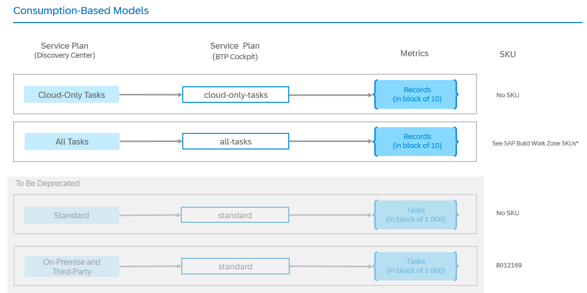
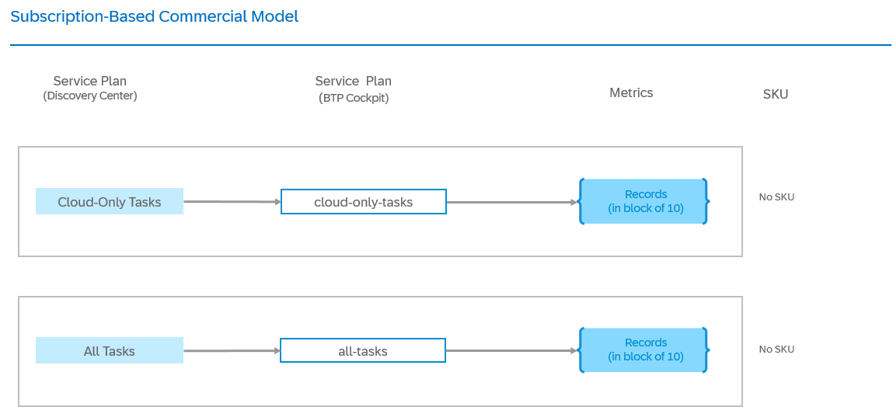

<!-- loio7b6b6898251f449a978fffdb27cc5e50 -->

<link rel="stylesheet" type="text/css" href="../css/sap-icons.css"/>

# Service Plans and Metering

This page explains the relationship between the service plans in the SAP Discovery Center and those in the SAP BTP cockpit, and provides information to help you understand how SAP Task Center is billed.

<a name="loio7b6b6898251f449a978fffdb27cc5e50__section_gwp_yyy_5zb"/>

## Service Overview

The following commercial models are available for SAP Task Center:

-   Consumption-based commercial model

-   Subscription-based commercial model

For more information, see [Commercial Models](https://help.sap.com/docs/btp/sap-business-technology-platform/commercial-models).

\* For more information on the SAP Build Work Zone SKUs, see [SAP Build Work Zone, standard edition - Service Plans and Metering](https://help.sap.com/docs/build-work-zone-standard-edition/sap-build-work-zone-standard-edition/commercial-models-and-metering) and [SAP Build Work Zone, advanced edition - Service Plans and Metering](https://help.sap.com/docs/build-work-zone-advanced-edition/sap-build-work-zone-advanced-edition/commercial-models-and-metering).

\* For more information on the SAP Build `build-default` service plan, see [SAP Build - Service Plans and Metering](https://help.sap.com/docs/build-service/build-service-guide/service-plans-and-metering).

<a name="loio7b6b6898251f449a978fffdb27cc5e50__section_hbp_bwc_w1c"/>

## Service Plans

### SAP BTP Cockpit: Service Plans

The information about the service plans is valid for both the consumption-based and subscription-based commercial models, except for the highlighted commercial-model-specific information.

<table>
<tr>
<th valign="top">

Name in SAP BTP Cockpit 

</th>
<th valign="top">

Service Plan in SAP Discovery Center

</th>
<th valign="top">

Description

</th>
</tr>
<tr>
<td valign="top">

`cloud-only-tasks`

</td>
<td valign="top">

*Cloud-Only Tasks*

</td>
<td valign="top">

To be used only with SAP Start.

The SAP Task Center free *Cloud-Only Tasks* service plan enables the integration of SAP Task Center with the supported SAP cloud solutions.

This service plan must be used only for the SAP Start use case \(in conjunction with the SAP Build Work Zone foundation service plan\). For more information, see [SAP Start - Service Plans and Metering](https://help.sap.com/docs/start/sap-start/availability).

Users are allowed to use for free up to 20 tasks \(2 blocks of 10 records\) stored in the SAP Task Center task cache for each active user on global account level. This is valid for up to 1 000 active users per month.

All tasks above this number are charged and you will be requested to use the consumption-based commercial model, `all-tasks` service plan.

</td>
</tr>
<tr>
<td valign="top">

`all-tasks`

</td>
<td valign="top">

*All Tasks*

</td>
<td valign="top">

The SAP Task Center *All Tasks* plan enables the integration of SAP Task Center with all supported SAP cloud, SAP S/4HANA on-premise, and third-party task providers.

This service plan must be used with the SAP Build Work Zone, standard edition; SAP Build Work Zone, advanced edition or SAP SuccessFactors Work Zone service plans. For more information, see [SAP Build Work Zone, standard edition - Service Plans and Metering](https://help.sap.com/docs/build-work-zone-standard-edition/sap-build-work-zone-standard-edition/commercial-models-and-metering) and [SAP Build Work Zone, advanced edition - Service Plans and Metering](https://help.sap.com/docs/build-work-zone-advanced-edition/sap-build-work-zone-advanced-edition/commercial-models-and-metering).

Users are allowed to use for free up to 20 tasks \(2 blocks of 10 records\) stored in the SAP Task Center task cache for each active user, and for each block of 100 SAP Build Work Zone connections on global account level.

> ### Note:  
> For the subscription-based commercial model:
> 
> -   All tasks above those 20 tasks are charged and you will be requested to use the consumption-based commercial model, `all-tasks` service plan.
> 
>     In this case you'll also need a SAP BTPEA \(SAP BTP Enterprise Agreement\) license. For more information, see [What Is the Consumption-Based Commercial Model?](https://help.sap.com/docs/btp/sap-business-technology-platform/what-is-consumption-based-commercial-model).
> 
> -   On a global account level all licensed users are considered as active users

</td>
</tr>
<tr>
<td valign="top" rowspan="2">

`standard`

</td>
<td valign="top">

*Standard*

</td>
<td valign="top">

This service plan is scheduled to be removed from the list of Eligible Cloud Services as of November 15, 2025. It will be available until the end of the current subscription term. It will not be available for renewal terms that begin after the removal date. You can use the *All Tasks* or *Build Default* service plans, which now include the features of the *Standard* service plan, or the *Cloud-Only Tasks* service plan if you want to integrate with the supported SAP cloud solutions.

</td>
</tr>
<tr>
<td valign="top">

*On-Premise and Third-Party*

</td>
<td valign="top">

This service plan is scheduled to be removed from the list of Eligible Cloud Services as of November 15, 2025. It will be available until the end of the current subscription term. It will not be available for renewal terms that begin after the removal date. You can use the *All Tasks* or *Build Default* service plans, which now include the features of the *On-Premise and Third-Party* service plan, or the *Cloud-Only Tasks* service plan if you want to integrate with the supported SAP cloud solutions.

</td>
</tr>
</table>

For more information on the SAP Task Center availability and service plans, see [SAP Task Center Service Plans on SAP Discovery Center](https://discovery-center.cloud.sap/protected/index.html#/serviceCatalog/sap-task-center?tab=service_plan&region=all).

<a name="loio7b6b6898251f449a978fffdb27cc5e50__section_x43_x1z_5zb"/>

## Metrics

<table>
<tr>
<th valign="top">

Metric

</th>
<th valign="top">

Definition

</th>
</tr>
<tr>
<td valign="top">

Records in Blocks of 10

</td>
<td valign="top">

The Usage Metric for the Cloud Service is Record. For this Cloud Service, tasks are counted.

</td>
</tr>
<tr>
<td valign="top">

Tasks in Blocks of 1 000

</td>
<td valign="top">

\(This metric is only for the *Standard* service plan.\)

Individual, structured data objects that are managed via the Cloud Service, such as characters, objects, tasks, and jobs.

For the Cloud Service, a record is a line-item in the input to the reconciliation process.

</td>
</tr>
</table>

Records with the service plan *All Tasks* are tasks, stored in the SAP Task Center task cache and are counted only for users who have used SAP Task Center at least once in the past 30 days. This defines the number of active SAP Task Center users. This count includes tasks in both the SAP Task Center *Inbox* and *Outbox*.

Please keep in mind that the tasks are kept in the SAP Task Center task cache for 180 days \(retention period\).

<a name="loio7b6b6898251f449a978fffdb27cc5e50__section_o4b_bsz_5zb"/>

## Backward Calculation

### Formula

You can have multiple instances of SAP Task Center in the same subaccount with different service plans, but only one active service plan. The active service plan for a subaccount is:

-   `build-default`, if there is at least one SAP Task Center instance with the `build-default` service plan.
-   `all-tasks`, if there is no instance with the `build-default` service plan and at least one instance with the `all-tasks` service plan.
-   `cloud-only-tasks`, if there is no instance with the `build-default` or `all-tasks` service plan, and at least one instance with the `cloud-only-tasks` service plan.
-   `standard`, if all instances are only with plan `standard`.

### Examples

> ### Example:  
> **Example 1:** You have a subaccount which contains SAP Task Center instances with the following plans:
> 
> -   `standard`
> -   `cloud-only-tasks`
> 
> The effective service plan is `cloud-only-tasks`. Only cloud tasks are allowed.

> ### Example:  
> **Example 2:** You have a subaccount which contains SAP Task Center instances with the following plans:
> 
> -   `standard`
> -   `cloud-only-tasks`
> -   `all-tasks`
> 
> The effective service plan is `all-tasks`. Cloud, on-premise and third-party tasks are allowed.

> ### Example:  
> **Example 3:** You have a subaccount which contains SAP Task Center instances with the following plans:
> 
> -   `standard`
> -   `all-tasks`
> 
> The effective service plan is `all-tasks`. Cloud, on-premise, and third-party tasks are allowed.

> ### Example:  
> **Example 4:** You have a subaccount which contains SAP Task Center instances with the following plans:
> 
> -   `build-default`
> -   `all-tasks`
> 
> The effective service plan is `build-default`. Cloud, on-premise, and third-party tasks are allowed.

<a name="loio7b6b6898251f449a978fffdb27cc5e50__section_avt_bvp_hfc"/>

## Migrating to a Different SAP Task Center Service Plan

If you're planning to switch from one SAP Task Center service plan to another, here's what you need to know:

### Service Plans Ranking

SAP Task Center offers the following service plans, which are ordered by priority:

1.  `build-default`
2.  `all-tasks`
3.  `cloud-only-tasks`
4.  `standard`

This ranking means that if your subaccount has multiple service instances with different service plans, the service instance with the highest-ranking plan in the list is the active one. For example, if you have a `build-default` plan, it takes priority over the other service plans.

In the case of multiple SAP Task Center instances in a single subaccount, only the instance with the highest-ranking plan will be active, but configuration from non-active service instances might still be used by SAP Task Center.

### How to Migrate to Another Service Plan

If you want to migrate from one SAP Task Center service plan to another, you must have in mind the service plans ranking.

> ### Tip:  
> If you want to migrate from a lower-ranking to a higher-ranking service plan \(for example, from `standard` to `all-tasks`\) you can just create a new service instance to the higher-ranking service plan, as described in *Steps 1-3* of the following procedure and skip the rest of the steps. In this case you'll continue having two service instances in your subaccount, but only the higher-ranking service plan will be active.
> 
> For a more comprehensive and organized approach, we recommend completing the entire migration procedure.

> ### Caution:  
> While performing the migration procedure, some functionalities of SAP Task Center might be temporarily inaccessible until the migration is complete. For example, this could affect the SAP Task Center Web app tile, or the push of task updates from task providers.

To migrate to the new service plan and remove unnecessary service instances and configurations, perform the following migration steps:

1.  Make sure that your subaccount is entitled to use SAP Task Center with the new service plan. For more information, see [Configure Entitlements and Quotas for Subaccounts](https://help.sap.com/docs/btp/sap-business-technology-platform/configure-entitlements-and-quotas-for-subaccounts).
2.  Navigate to your Cloud Foundry subaccount which contains an instance of the old SAP Task Center service plan.
3.  In the same subaccount, create a new service instance with the new service plan. For more information on how to create a new service instance, see [Create a Service Instance Using the SAP BTP Cockpit](../30-initial-setup/create-a-service-instance-using-the-sap-btp-cockpit-dc9af9f.md).
4.  In the *Destinations* tab, delete the existing *Task\_Center* destination for the central point of entry for accessing applications. For more information, see [Destination for the Central Point of Entry for Accessing Applications](../40-administration/destination-for-the-central-point-of-entry-for-accessing-applications-10320af.md).
5.  Create a new service instance destination to the new service instance, and name it *Task\_Center*, following the documentation at [Destination for the Central Point of Entry for Accessing Applications](../40-administration/destination-for-the-central-point-of-entry-for-accessing-applications-10320af.md).
6.  Go to your central point of entry for accessing applications.
    1.  On the *Channel Manager* tab \(\), update the content of the *HTML5 Apps* by choosing :arrows_clockwise:.
    2.  On the *Content Manager* tab \(:package:\), choose the *Content Explorer* button, and choose *HTML5 Apps*.
    3.  Remove the *Task Center* and, if available, *Task Center Administration* content items.
    4.  Add the *Task Center* and *Task Center Administration* content items again.
    5.  On the *Content Manager* tab, open the designed role for the application users and reassign the respective app to the correct role. For more information, find the documentation of your central point of entry for accessing applications at [Create a Task Center Tile](../30-initial-setup/create-a-task-center-tile-70e7f6e.md).

7.  For every destination with enabled push of tasks \(for example, SAP SuccessFactors, SAP S/4HANA Cloud Public Edition\) create new service instances with the new service plan, and update the credentials as follows:
    1.  Create a new dedicated service instance to the new service plan to enable task updates to be pushed from the task provider to SAP Task Center.
    2.  In the new service instance, create a new service key.
    3.  Exchange the old by the new credentials in the task provider system, as described in the respective task provider documentation. For more information, see also [Credentials Rotation](../60-security/credentials-rotation-8080abf.md).

        > ### Note:  
        > Keep in mind that no task updates will be pushed until you update the *tc.clientId* property in the next step.

    4.  In your *Cloud Foundry subaccount* \> *Destinations tab*, go to the task provider destination and update the value of the *tc.clientId* property, as described in the respective task provider topic. For more information, see [Destinations to Task Providers](../40-administration/destinations-to-task-providers-b158111.md).

8.  \(Optional\) If you previously have created SAP Task Center service instances with keys and bindings for accessing the SAP Task Center API for the old service plan, make sure that you create new SAP Task Center instances from the new service plan, and new keys and bindings to be used for accessing the SAP Task Center API.
9.  Delete all service keys and bindings which are associated with SAP Task Center instances of the old service plan.
10. Delete all service instances which are associated with old service plans.
11. Make sure that your SAP Task Center applications are working with the new service plan.

<a name="loio7b6b6898251f449a978fffdb27cc5e50__section_mjy_gbz_5zb"/>

## Supplemental Terms and Conditions

For more information, see the [SAP Business Technology Platform Service Description Guide](https://www.sap.com/about/trust-center/agreements/cloud/cloud-services.html?sort=latest_desc&tag=language%3Aenglish&pdf-asset=82ce6fed-917e-0010-bca6-c68f7e60039b&page=1), *SAP TASK CENTER* section.

<a name="loio7b6b6898251f449a978fffdb27cc5e50__section_bl4_4tz_5zb"/>

## Glossary

[Commercial Information Glossary](https://help.sap.com/docs/help/5d771150f8f547c6bc604c7d674cf30d/7014f9db099148f1897c1bda5db21f39.html)

