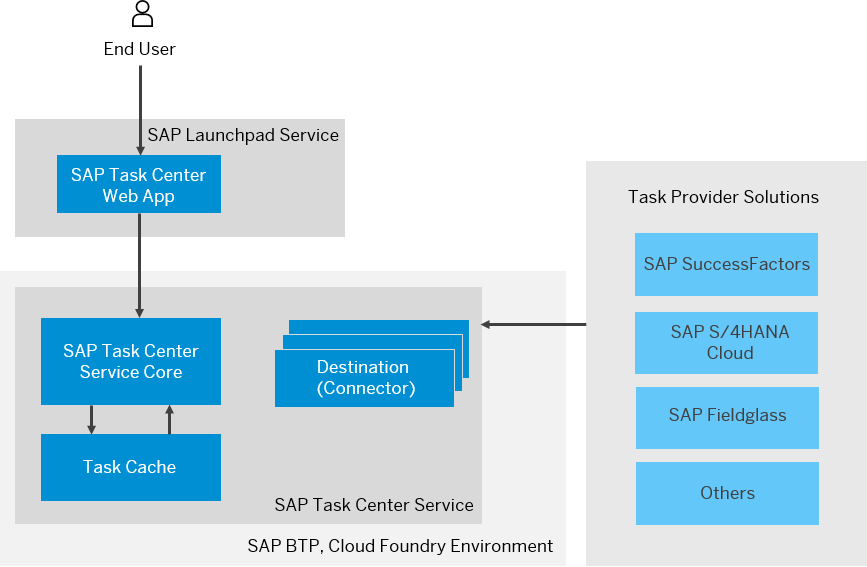

<!-- loio9693186f1fe54cbe801085d6bdfe8287 -->

<link rel="stylesheet" type="text/css" href="../css/sap-icons.css"/>

# What Is SAP Task Center?

SAP Task Center helps you integrate tasks into a central solution. 

The SAP Task Center service enables integration with SAP applications to provide a single entry point for end users to access all their assigned tasks. The tasks can be accessed by end users through the SAP Task Center Web application.

You can use SAP Task Center as a unified inbox for tasks across multiple applications with integrated user experience. Tasks from multiple SAP solutions are gathered in one list and ready to be processed in just one click, shortening the completion time for business-critical tasks. For example, business users can process all their tasks from the connected systems, without the need to switch and log in separately into different inboxes.

For more information, see also SAP Task Center on [SAP Discovery Center](https://discovery-center.cloud.sap/serviceCatalog/sap-task-center?region=all).

## Environment

This service runs in the SAP BTP, Cloud Foundry environment.

## Features

SAP Task Center offers an array of capabilities, for example:

<dl>
<dt><b>

Task Federation 

</b></dt>
<dd>

Federate your tasks from various provider applications via a unified REST interface. Store them in a task cache for resilience and instantaneous access.

</dd><dt><b>

SAP Task Center for Task Processing 

</b></dt>
<dd>

Access all tasks assigned to you in the SAP Task Center Web app. Search, sort and filter the displayed tasks based on predefined criteria. Navigate to the native task application for full task details and set of actions.

</dd>
</dl>

## SAP Task Center Overview

> ### Tip:  
> This version of the guide is open for contributions and feedback using GitHub. This allows you to get in contact with responsible authors of SAP Help Portal pages and the development team to discuss documentation-related issues. To contribute to this guide, or to provide feedback, choose the corresponding option on SAP Help Portal:
> 
> -   :pencil2:: Contribute to a documentation page. This option opens a pull request on GitHub.
> 
> -    Feedback: Provide feedback about a documentation page. This option opens an issue on GitHub.
> 
> 
> You need a GitHub account to use these options.
> 
> More information:
> 
> -   [Collaborate with us – SAP Task Center Opens It‘s Documentation for Your Feedback with GitHub!](https://blogs.sap.com/2023/02/01/collaborate-with-us-sap-task-center-opens-its-documentation-for-your-feedback-with-github/comment-page-1/#comment-658159)
> 
> -   [Contribution Guidelines](https://help.sap.com/docs/open-documentation-initiative/contribution-guidelines/readme.html)
> 
> -   [Introduction Video: Open Documentation Initiative](https://www.youtube.com/watch?v=WJ0oarMlVW4)
> 
> -   [Blog Post: Introducing the Open Documentation Initiative](https://blogs.sap.com/2021/05/20/introducing-the-open-documentation-initiative/)

**Related Information**  

[Conventions and Technical Restrictions](conventions-and-technical-restrictions-f0f13bf.md "These conventions and restrictions apply to the SAP Task Center.")

[Supported Languages](supported-languages-c66c693.md "")

[Supported Solutions and Use Cases](supported-solutions-and-use-cases-758209c.md "See the list of the supported solutions and use cases in SAP Task Center.")

[Browser Support](browser-support-d769477.md "")

[Accessibility Features in SAP Task Center](accessibility-features-in-sap-task-center-b77f9a3.md "To optimize your experience of SAP Task Center, SAP Business Technology Platform (SAP BTP) provides features and settings that help you use the software efficiently.")

