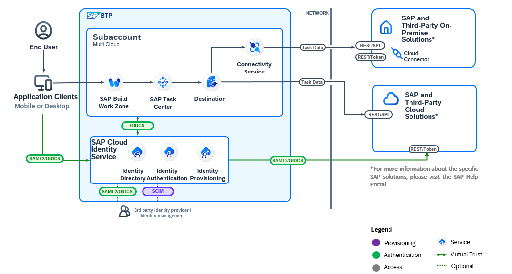
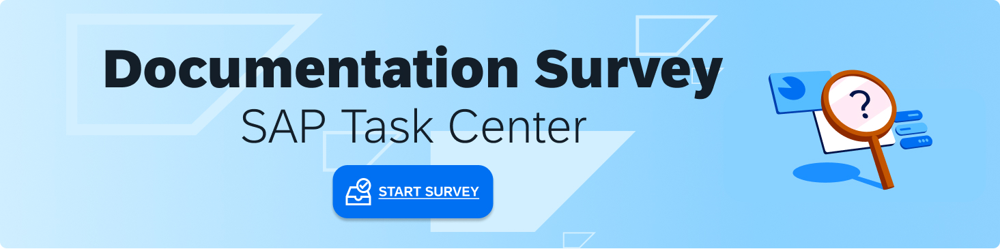

<!-- loio9693186f1fe54cbe801085d6bdfe8287 -->

# What Is SAP Task Center?

SAP Task Center helps you integrate tasks into a central solution. 

The SAP Task Center service enables integration with SAP and non-SAP applications to provide a single entry point for end users to access all their assigned tasks. The tasks can be accessed by end users through the SAP Task Center Web app, SAP Mobile Start app, and SAP Start.

You can use SAP Task Center as a unified inbox for tasks across multiple applications with integrated user experience. Tasks from multiple SAP solutions are gathered in one list and ready to be processed in just one click, shortening the completion time for business-critical tasks. For example, business users can process all their tasks from the connected systems, without the need to switch and log in separately into different inboxes.

For more information, see also SAP Task Center on [SAP Discovery Center](https://discovery-center.cloud.sap/serviceCatalog/sap-task-center?region=all).

## Environment

This service runs in the SAP BTP, Cloud Foundry environment.

## Features

SAP Task Center offers an array of capabilities, for example:

<dl>
<dt><b>

Task Federation 

</b></dt>
<dd>

Federate your tasks from various provider applications via a unified REST interface. Store them in a task cache for resilience and instantaneous access.

</dd><dt><b>

SAP Task Center for Task Processing 

</b></dt>
<dd>

Access all tasks assigned to you in the SAP Task Center Web app. Search, sort and filter the tasks based on predefined criteria. Review task details and perform actions, or navigate to the native task application for full task details and set of actions.

</dd>
</dl>

## SAP Task Center Overview

### Feedback in GitHub

> ### Tip:  
> The English version of this guide is open for contributions and feedback using GitHub. This allows you to get in contact with responsible authors of SAP Help Portal pages and the development team to discuss documentation-related issues. To contribute to this guide, or to provide feedback, choose the corresponding option on SAP Help Portal:
> 
> -   *Feedback* \> *Create issue*: Provide feedback about a documentation page. This option opens an issue on GitHub.
> 
> -   *Feedback* \> *Edit page*: Contribute to a documentation page. This option opens a pull request on GitHub.
> 
> 
> You need a GitHub account to use these options.
> 
> More information:
> 
> -   [Collaborate with us – SAP Task Center Opens Its Documentation for Your Feedback with GitHub!](https://blogs.sap.com/2023/02/01/collaborate-with-us-sap-task-center-opens-its-documentation-for-your-feedback-with-github/comment-page-1/#comment-658159)
> 
> -   [Contribution Guidelines](https://help.sap.com/docs/open-documentation-initiative/contribution-guidelines/readme.html)
> 
> -   [Introduction Video](https://www.youtube.com/watch?v=WJ0oarMlVW4)
> 
> -   [Introduction Blog Post](https://blogs.sap.com/2021/11/29/sap-btp-documentation-goes-github-new-collaboration-process/)

### SAP Task Center Documentation Survey

As we work to ensure the SAP Task Center documentation meets your needs, your feedback is essential. Please take a moment to complete our short, anonymous survey, which will take about two minutes. No personal information is collected.

You can access the survey at [SAP Task Center Documentation Survey](https://sapinsights.eu.qualtrics.com/jfe/form/SV_0vVIWrgxNFKVeGW?source=HP).

If you have additional thoughts or specific suggestions, you can also provide them using the comments function in the *Feedback* section in the header of this page. We value your detailed input to help us make the documentation as useful and relevant as possible.

**Related Information**  

[Conventions and Technical Restrictions](conventions-and-technical-restrictions-f0f13bf.md "These conventions and restrictions apply to the SAP Task Center.")

[Supported Languages](supported-languages-c66c693.md "See the languages, supported by SAP Task Center for tasks and task definitions, which are coming from SAP or third-party task providers.")

[Supported Solutions and Use Cases](supported-solutions-and-use-cases-758209c.md "Review the list of the supported solutions and use cases in SAP Task Center.")

[Supported Features](supported-features-257a0ad.md "See the SAP Task Center features, supported by SAP, or third-party task providers.")

[Browser Support](browser-support-d769477.md "")

[Accessibility Features in SAP Task Center](accessibility-features-in-sap-task-center-b77f9a3.md "To optimize your experience of SAP Task Center, SAP Business Technology Platform (SAP BTP) provides features and settings that help you use the software efficiently.")

[Service Plans and Metering](service-plans-and-metering-7b6b689.md "This page explains the relationship between the service plans in the SAP Discovery Center and those in the SAP BTP cockpit, and provides information to help you understand how SAP Task Center is billed.")

