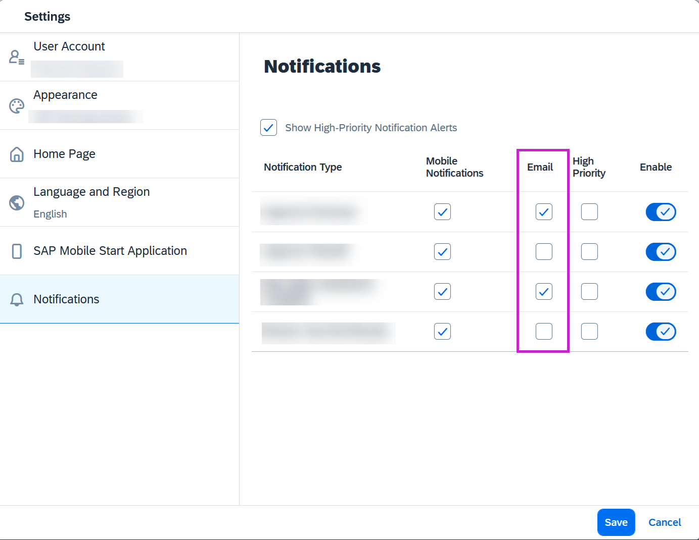

<!-- loiob1b9c15ef2c04985b896a1e4619817cd -->

# Troubleshooting Notifications at SAP Task Center

Steps for SAP Task Center administrators to troubleshoot and resolve issues when end users are not receiving notifications in the SAP Task Center Web App or via email.

> ### Note:  
> Notifications in SAP Task Center work only if your central point of entry for accessing applications is SAP Build Work Zone, standard edition or SAP Build Work Zone, advanced edition.
> 
> Notifications are not generated during the initial pull job, which loads existing tasks into the end users inbox. End users receive notifications only for new tasks assigned to them.
> 
> For more information on how to enable notifications for end users, see [Enable Notifications for End Users](../40-administration/enable-notifications-for-end-users-caf2543.md).

<a name="loiob1b9c15ef2c04985b896a1e4619817cd__section_lxh_hlt_cdc"/>

## A user does not receive notifications in the SAP Task Center Web app

### 1. Check the property `tc.notifications.enabled`.

Make sure that the `tc.notifications.enabled` property in the task provider destination is set to `true`. For more information, choose your task provider topic from the list of [Destinations to Task Providers](../40-administration/destinations-to-task-providers-b158111.md).

### 2. Check the destination *Identity\_Authentication\_Connectivity\_IDS*.

From the **Task Center Administration ****app**\> *Service Status*, check if the *Identity\_Authentication\_Connectivity\_IDS* destination's status is *OK*.

For more information on the Task Center Administration app, see [Working with the Task Center Administration App](../40-administration/working-with-the-task-center-administration-app-3a1598c.md).

The destination *Identity\_Authentication\_Connectivity\_IDS* should be created in your Cloud Foundry subaccount. For more information, see [Identity Directory Connectivity](../40-administration/identity-directory-connectivity-3dcfba9.md). If you have set up the connectivity with *ClientCertificateAuthentication*, ensure that the uploaded certificate is valid.

If multiple Identity Authentication services are in use, the destination should be directed to the same Identity Authentication that the end user has logged into.

### 3. Check the destination *Alert\_Notification\_Connectivity\_ANS*.

Make sure you've configured the *Alert\_Notification\_Connectivity\_ANS* destination in your Cloud Foundry subaccount. For more information, see [Alert Notifications Connectivity](../40-administration/alert-notifications-connectivity-f6c9f3b.md).

### 4. Check the property `tc.languages`.

Go to your Cloud Foundry subaccount and select the *Destinations* tab. In the *Task\_Center\_global\_settings* destination ensure the `tc.languages` property contains `en-US` as value.

<a name="loiob1b9c15ef2c04985b896a1e4619817cd__section_zht_1t3_ddc"/>

## A user does not receive email notifications from SAP Task Center

### 1. Check the SMTP mail configuration.

Make sure a destination is pointing to the SMTP mail server of your company. For more information, see [Alert Notifications Connectivity](../40-administration/alert-notifications-connectivity-f6c9f3b.md) and [Configuring an SMTP Mail Destination](https://help.sap.com/docs/build-work-zone-standard-edition/sap-build-work-zone-standard-edition/configuring-smtp-mail-destination).

### 2. Make sure that the email notifications are enabled in the end user's inbox.

The end user should check in the Web app if the notifications are enabled from their *User Menu* \> ** *Settings* \> ** *Notifications* \> ** *Email*.

### 3. If the end users receive email notifications, but the link from the email doesn't work, check the property `tc.wz.home.url`.

If email notifications work, but the link from the email doesn't, make sure the property <code><code>tc.wz.home.url</code></code> in the destination *Task\_Center\_global\_settings* is set. For more information, see [SAP Task Center Global Settings](../40-administration/sap-task-center-global-settings-99e5302.md).

> ### Tip:  
> If the troubleshooting steps, didn't help you resolve the notifications issue, please submit an incident to SAP Task Center. For more information on the support components, see [3044195 - SAP Task Center Support Components](https://me.sap.com/notes/3044195/E).
> 
> When submitting the incident, please include the following information:
> 
> -   Landscape information \(for example, EU10, US10\).
> 
> -   The URL of the page where the incident or error occurs.
> 
> -   Your tenant ID or subaccount ID.
> 
> -   The steps or clicks used to replicate the error.
> 
> -   Screenshots, videos, or the code entered.
> 
> 
> Please mention also your task providers, details about your authorization method, and links to the documentation you have followed.
> 
> Use the [Export SAP Task Center Service Data](../40-administration/export-sap-task-center-service-data-1dfb750.md) \(or [API Data Export](https://api.sap.com/api/TaskCenterAPIForCloudFoundry/resource/Data_Export)\) to export data for the task provider and attach it to the ticket.

